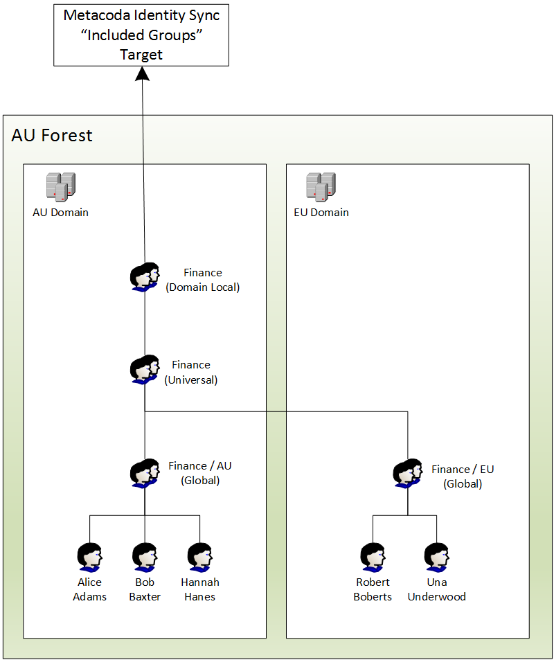
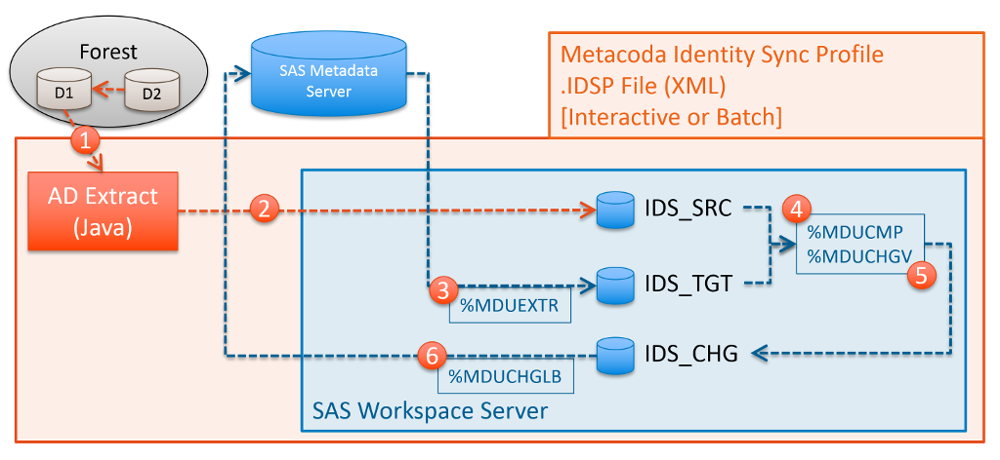

# Active Directory Domains

This section describes some of the common scenarios when synchronising SAS metadata with Microsoft
Active Directory (AD) domains and how Metacoda Identity Sync Profiles (IDSPs) can support these.

## Single Domain / Single IDSP

The most common scenario is synchronising with a single domain. This can be supported with a single
IDSP as described in the *Single (Basic) Identity Sync Profile* section of
[Identity Sync Profiles & Process](idsp.md) and illustrated below:

## Multiple Domains / Single Forest / Single IDSP

Sometimes it is necessary to synchronise with multiple AD domains. If these domains are all within
the same AD forest then this can also be supported with a single IDSP. When following the well
known [AGDLP or AGUDLP](https://en.wikipedia.org/wiki/AGDLP) models for organising groups that span
domains, the IDSP can target groups in one of the domains and the Metacoda Identity Sync process
will follow group members into other domains in the same forest as shown in the diagram below.
 

The IDSP targets the AU domain in the AU forest. The Finance Domain Local group is one of the
included groups. When processing group members, the Finance Universal group includes a Finance
Global group from the EU domain (in the same forest) so all of its members are also considered
for synchronisation.  

The Identity Sync Process for this scenario is very similar to the single domain scenario except
that the source identity extraction process can return members from multiple domains in the same
forest. The following diagram illustrates this variation.   

In scenarios like this, where multiple domains are involved, you will most likely want to choose
pseudo-attributes, such as *sAMAccountNameWithDomain*, that automatically include the name of the
source domain (as dynamically determined from the directory) when choosing attributes mappings
in the Identity Sync Profile Wizard.

## Multiple Domains / Multiple Forests / Hybrid IDSP

When SAS metadata identities need to be sourced from multiple AD domains, across multiple AD
forests, it is necessary to use a Hybrid IDSP with at least one child IDSP per forest.
For more information on Hybrid IDSPs see the *Multiple (Hybrid) Identity Sync Profiles* section of
[Identity Sync Profiles & Process](idsp.md).

The diagram below illustrates the Identity Sync Process for this scenario, where there are two
AD domains, D1 and D2, which are in different AD forests. There are two child IDSPs, one for each
domain, wrapped up in a Hybrid IDSP. 

## Foreign Security Principals

Occasionally when dealing with multiple domains you may encounter the following error message
during the Identity Sync Process:

*Failed to fetch included AD groups: Can't follow Foreign-Security-Principal into trusted domain
for AD identity (with DN 'CN=S-1-5-21-1234567890-123456789-123456789-1234,CN=ForeignSecurityPrincipals,DC=d1,DC=example,DC=com').*

This is an error generated to highlight the fact that at least one of the targeted groups in the D1
domain contains a member from a domain in a different forest. This indicates a situation where
there are multiple AD forests with trust relationships. Whilst the single IDSP scenarios support
following groups into domains within the same forest, they do not support following groups into
domains in other forests. To synchronise with multiple domains across one or more forests it is
necessary to use Hybrid IDSPs and, if required, modify any affected child IDSPs to ensure they
ignore Foreign Security Principals.

To ignore Foreign Security Principals, the IDSP will need to be modified using a text editor, and
the *foreignSecurityPrincipalHandling* attribute added to the *LDAPConfig* tag with a value of
*ignore* like so:

        <LDAPConfig
        ...
        foreignSecurityPrincipalHandling="ignore"
        />

This will ignore any group members that come from another forest (instead of generating an error).
If those members are actually required in SAS metadata then you will need to ensure that they are
within a targeted group in the hybrid child IDSP that corresponds to that foreign domain.