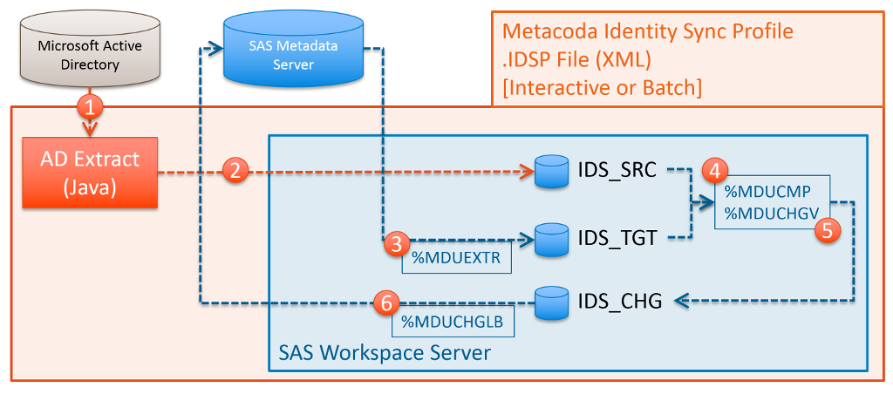

# Using Canonical Tables

As explained in [Identity Sync Profiles & Process](idsp.md), and shown in the diagram below,
the Metacoda Identity Sync Process normally uses three temporary SAS libraries for intermediate
[canonical](https://support.sas.com/documentation/cdl/en/bisecag/69827/HTML/default/p1o31lg0trorn8n1rketxxe1jbr1.htm)
and change tables as required by the SAS %MDU macros.

These libraries are named IDS_SRC, IDS_TGT, and IDS_CHG, for source, target and change tables
respectively. Unless otherwise specified in the Identity Sync Profile (IDSP), these libraries will
be created as subdirectories of the temporary SAS WORK library/folder for the spawned SAS Workspace
Server instance and automatically deleted then the workspace server instance is stopped when the
process completes.        

## Switching to Permanent Libraries

Whilst the temporary nature of the IDS_SRC, IDS_TGT, and IDS_CHG libraries is appropriate for
most scenarios, sometimes you might want to retain these tables after the identity sync process
has completed. This might be for troubleshooting purposes or to re-use the tables for you own
custom requirements.

To make these libraries permanent, you need to select or create a directory in the file system of
the SAS Workspace Server that will used for identity synchronisation, and ensure appropriate file
system access controls to allow the workspace server operating system launch identity to create
sub-directories and read/write SAS tables in those directories.

Once you have a location, it can be specified by editing the IDSP in a text editor and adding a
serverBaseDir attribute to the `<Options>` tag like so:     

    <IdentitySyncProfile ... />
        ...
        <Options
            ...
            serverBaseDir=“Data/idsync”
        />
    ...
    </IdentitySyncProfile>

The serverBaseDir value is a file system path that can be either relative or absolute. If a
relative path is specified then it is relative to the SAS Application Server directory.
For example, given the *Data/idsync* value specified above, if the SAS Application Server directory
is */opt/sas/config/Lev1/SASApp* then the following locations will be used for the three libraries:

* IDS_SRC: /opt/sas/config/Lev1/SASApp/Data/idsync/ids_src 
* IDS_TGT: /opt/sas/config/Lev1/SASApp/Data/idsync/ids_tgt 
* IDS_CHG: /opt/sas/config/Lev1/SASApp/Data/idsync/ids_chg 

The ids_src, ids_tgt, and ids_chg sub-directories will be automatically created if they do not
already exist. 

## Libraries and Tables

### IDS_SRC: Source Tables

The IDS_SRC library contains tables that represent source/master identities for synchronisation.
These usually contain users and groups extracted from Microsoft Active Directory.
When using a Hybrid IDSP, the tables will contain combined identity information from all sources.    

| Table     | Description     |
| ---------- | ------------- |
| IDS_SRC.AUTHDOMAIN    | Standard SAS canonical table: authentication domains. |
| IDS_SRC.EMAIL         | Standard SAS canonical table: email addresses for users. |
| IDS_SRC.GRPMEMS       | Standard SAS canonical table: group/role members. |
| IDS_SRC.IDGRPS        | Standard SAS canonical table: groups/roles. |
| IDS_SRC.IDGRPS_X      | Metacoda table: groups/roles with extra attributes (1). |
| IDS_SRC.IDS_EXCEPTION | Metacoda table: sync exceptions (2). |
| IDS_SRC.LOCATION      | Standard SAS canonical table: physical addresses for users. |
| IDS_SRC.LOGINS        | Standard SAS canonical table: logins/accounts for users & groups. |
| IDS_SRC.PERSON        | Standard SAS canonical table: users. |
| IDS_SRC.PERSON_X      | Metacoda table: users with extra attributes (1). |
| IDS_SRC.PHONE         | Standard SAS canonical table: phone numbers for users. |

(1) The IDS_SRC.IDGRPS_X and IDS_SRC.PERSON_X tables are only populated if the IDSP LDAPConfig
tag has the groupOtherAttrs and userOtherAttrs attributes specified respectively.
These tables are copies of the corresponding IDS_SRC.IDGRPS and IDS_SRC.PERSON tables with
additional X_ prefixed columns for each of the additional LDAP attributes specified. These extra
attributes are not used in the normal Metacoda Identity Sync Process but may be of use in any
custom processing requirements implemented in code hooks or elsewhere. 

(2) The IDS_SRC.IDS_EXCEPTION table is populated by the Metacoda Identity Sync Process from the sync
exceptions specified in the IDSP (with `<SyncException>` tags). This table is provided to the
standard SAS %MDUCMP macro during the identity comparison step, via the *EXCEPTIONS* parameter.

### IDS_TGT: Target Tables
 
The IDS_TGT library contains tables that represent target identities for synchronisation: 
users and groups currently in SAS metadata.
The contents of this library is generated by the use of the standard SAS %MDUEXTR macro.

| Table     | Description     |
| ---------- | ------------- |
| IDS_TGT.AUTHDOMAIN | Standard SAS canonical table: authentication domains. |
| IDS_TGT.EMAIL | Standard SAS canonical table: email addresses for users. |
| IDS_TGT.EMAIL_INFO | Standard SAS canonical table: email addresses for users (additional info). |
| IDS_TGT.GROUP_INFO | Standard SAS canonical table: groups (additional info). |
| IDS_TGT.GROUPLOGINS_INFO | Standard SAS canonical table: logins/accounts for groups (additional info). |
| IDS_TGT.GROUPMEMGROUPS_INFO | Standard SAS canonical table: group/role group members (additional info). |
| IDS_TGT.GROUPMEMPERSONS_INFO | Standard SAS canonical table: group/role user members (additional info). |
| IDS_TGT.GRPMEMS | Standard SAS canonical table: group/role members. |
| IDS_TGT.IDGRPS | Standard SAS canonical table: groups/role. |
| IDS_TGT.LOCATION | Standard SAS canonical table: physical addresses for users. |
| IDS_TGT.LOCATION_INFO | Standard SAS canonical table: physical addresses for users (additional info). |
| IDS_TGT.LOGINS | Standard SAS canonical table: logins/accounts for users & groups. |
| IDS_TGT.LOGINS_INFO | Standard SAS canonical table: logins/accounts for users (additional info). |
| IDS_TGT.PERSON | Standard SAS canonical table: users. |
| IDS_TGT.PERSON_INFO | Standard SAS canonical table: users (additional info). |
| IDS_TGT.PHONE | Standard SAS canonical table: phone numbers for users. |
| IDS_TGT.PHONE_INFO | Standard SAS canonical table: phone numbers for users (additional info). |

### IDS_CHG: Change Tables 

The IDS_CHG library contains tables that represent changes required to target (SAS metadata)
identities to bring them back in sync with the sources identities. 
The contents of this library is generated by the use of the standard SAS %MDUCMP macro and may be
further customized by post-processing if the tag-delete feature has been enabled in the IDSP. 

| Table     | Description     |
| ---------- | ------------- |
| IDS_CHG.AUTHDOMAIN_ADD | Standard SAS change table: authentication domains to be added. |
| IDS_CHG.AUTHDOMAIN_DELETE | Standard SAS change table: authentication domains to be deleted. |
| IDS_CHG.AUTHDOMAIN_SUMMARY | Standard SAS change table: summary of authentication domains. |
| IDS_CHG.AUTHDOMAIN_UPDATE | Standard SAS change table: authentication domains to be updated. |
| IDS_CHG.EMAIL_ADD | Standard SAS change table: user email addresses to be added. |
| IDS_CHG.EMAIL_DELETE | Standard SAS change table: user email addresses to be deleted. |
| IDS_CHG.EMAIL_UPDATE | Standard SAS change table: user email addresses to be updated. |
| IDS_CHG.GRPMEMS_ADD | Standard SAS change table: members to be added to groups/roles. |
| IDS_CHG.GRPMEMS_DELETE | Standard SAS change table: members to be removed from groups/roles|
| IDS_CHG.IDGRPS_ADD | Standard SAS change table: groups to be added. |
| IDS_CHG.IDGRPS_DELETE | Standard SAS change table: groups to be deleted. |
| IDS_CHG.IDGRPS_SUMMARY | Standard SAS change table: summary of groups. |
| IDS_CHG.IDGRPS_UPDATE | Standard SAS change table: groups to be updated. |
| IDS_CHG.IDS_ERROR | A table populated if changes are not valid. See the SAS %MDUCHGV macro *ERRORSDS* parameter. |
| IDS_CHG.IDS_FAILED_OBJS | A table populated if changes failed to be applied to SAS metadata. See the SAS %MDUCHGLB macro *FAILEDOBJS* parameter. |
| IDS_CHG.LOCATION_ADD | Standard SAS change table: user physical addresses to be added. |
| IDS_CHG.LOCATION_DELETE | Standard SAS change table: user physical addresses to be deleted. |
| IDS_CHG.LOCATION_UPDATE | Standard SAS change table: user physical addresses to be updated. |
| IDS_CHG.LOGINS_ADD | Standard SAS change table: user & group logins/accounts to be added. |
| IDS_CHG.LOGINS_DELETE | Standard SAS change table: user & group logins/accounts to be deleted. |
| IDS_CHG.PERSON_ADD | Standard SAS change table: users to be added. |
| IDS_CHG.PERSON_DELETE | Standard SAS change table: users to be deleted. |
| IDS_CHG.PERSON_SUMMARY | Standard SAS change table: summary of users. |
| IDS_CHG.PERSON_UPDATE | Standard SAS change table: users to be updated. |
| IDS_CHG.PHONE_ADD | Standard SAS change table: user phone numbers to be added. |
| IDS_CHG.PHONE_DELETE | Standard SAS change table: user phone numbers to be deleted. |
| IDS_CHG.PHONE_UPDATE | Standard SAS change table: user phone numbers to be updated. |

If the IDSP `<Options>` tag has the *tagDeletedIdentities* attribute set to *true*, indicating
tag-deletion has been requested, then these change tables will be post-processed by the Metacoda
Identity Sync Process to convert user and group deletions into tag-deletions (updates). Tag
deletion, is a reversible process, that marks SAS users and groups as ready to be manually deleted,
and effectively disables them without destroying other metadata relationships they may have.

When users and groups are tag-deleted:

* Tag deleted User and Group display names are prefixed with text as specified in the IDSP
  `<Options>` tag *deletedIdentityTag* attribute so that they sort together (e.g. "Bob" becomes
  "[DELETED] Bob").
* Tag deleted User and Group logins are removed, so that nobody can login to the SAS platform as
  those identities.
* Tag deleted User and Group role and group memberships are removed.
  
These tag deletions will be seen as appropriate modifications to the change tables above.
For example this includes, but is not limited to, the IDS_CHG.PERSON_DELETE, IDS_CHG.IDGRPS_DELETE
being emptied and corresponding rows added to the IDS_CHG.PERSON_UPDATE, IDS_CHG.IDGRPS_UPDATE
tables.

The IDS_CHG library folder can also contain PROC METADATA XML request and response files if
the `<Options>` tag has debug set to true.