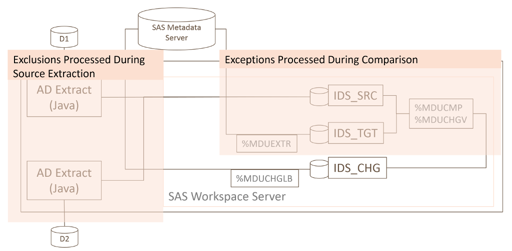

# Exclusions & Exceptions

There are two ways to prevent changes for specified users and groups in SAS metadata when using the
Metacoda Identity Sync Process: Exclusions and Exceptions.
Both methods have the same goals: prevent specific users or groups from being added to SAS
metadata; and avoid updating or deleting specific SAS identity metadata.
There are however some differences in implementation that may make you either choose one of the
methods or a combination of the two.    

As highlighted in the diagram below, exclusions are handled during the Java-based source identity
extraction step, whereas exceptions are handled during the SAS language based source/target
comparison step. More specifically, exceptions are handled using the standard SAS %MDUCMP macro's
support for an exceptions table. 

## Exclusions

Exclusions are used to prevent certain source identities, such as Active Directory (AD) users
and groups, from getting to the [canonical tables](canonical-tables.md) and being considered
in the comparison with existing target SAS metadata identities.
Exclusions are specified in the Identity Sync Profile (IDSP) and can be added either using the
Identity Sync Profile Wizard or by editing the IDSP XML directly.
There are several reasons why you might want to exclude identities at this stage:

* You are using a sync-basis that targets all users/groups under a certain Organizational Unit (OU)
  in the directory, but need to exclude some users/groups that are not SAS platform related.
* You are using a sync-basis that targets selected groups and their members but need to exclude
  some user/group members that are not SAS platform related.
* You might have service identities that need to be ignored and, as group members or descendants
  of an OU, would otherwise be targeted for synchronisation.

One of the key ways that exclusions differ from exceptions is in the handling of excluded group
members. During source identity extraction, if a group is excluded then its members are ignored.
This includes nested groups and their members too. A member of an excluded group will then only be
included if it is either explicitly included in the IDSP, or is a member of another group which
has not been excluded. This differs from exceptions in that if a group is ignored during exception
processing then it has no bearing on that groups members (unless the filter condition is such that
it affects some members too). This difference in the handling of exclusions and exceptions can be
used beneficially. If you want to ignore a group and its members use an exclusion. If you
want to ignore the group but keep its members use an exception instead.

Another difference is in support for wildcards. Exclusions target a specific identity without
support for wildcards. Exceptions, as SAS WHERE clause expressions, support
the use of wildcards to ignore a set of identities based on similarities in their names for
example.  If you need wildcard support choose exceptions over exclusions.

The following fragment shows how user and group exclusions are represented in an IDSP: 
 
    <IdentitySyncProfile ...>
      ...
      <GroupSync ...>
        ...
        <ExcludedGroups>
          <Group name="Group1" dn="CN=Group1,CN=Users,DC=corp,DC=example,DC=com" guid="4db9ff77-2096-4748-b0ce-7b0f3aa7942d"/>
          <Group name="Group2" dn="CN=Group2,CN=Users,DC=corp,DC=example,DC=com" guid="acbf94df-d5ac-46ec-be3c-feb5880b2be3"/>
        </ExcludedGroups>
        ...
      </GroupSync>
      <UserSync ... excludeDisabledAccounts="false">
        <ExcludedUsers>
          <User name="User1" dn="CN=User1,CN=Users,DC=corp,DC=example,DC=com" guid="4c1f064a-865e-4359-b9b6-6580b3dfc80f"/>
          <User name="User2" dn="CN=User2,CN=Users,DC=corp,DC=example,DC=com" guid="34be56af-c639-4ac7-96f5-11ce0690ebfb"/>
          ...
        </ExcludedUsers>
      </UserSync>
      ...
    </IdentitySyncProfile>

Group exclusions are specified using `<Group>` tags inside an `<ExcludedGroups>` tag in the main
`<GroupSync>` tag. Similarly user exclusions are specified as `<User>` tags inside the
`<ExcludedUser>` tag in the main `<UserSync>` tag. The users and groups are identified primarily
via the *guid* attribute value. If a guid is not specified, or an identity with that guid cannot be
located, the *dn* attribute value, if specified, is used to locate the source identity instead.
If a source identity cannot be found by guid or dn a warning is logged and the exclusion
ignored.
The *name* attr is not used for locating identities. It is primarily used to make it easier for
people to locate the correct tag when editing an IDSP.
 
After an excluded identity has been found, any differences between the directory and IDSP with
respect to guid, dn and name attributes is logged. Any differences in guid values are logged as
warnings (because it is unexpected and may well be a copy/paste error).

By default, any Active Directory users whose accounts have been marked as disabled in AD are
still extracted (given they still exist in AD). If you want to automatically exclude those users
you can add `excludeDisabledAccounts="false"` to the `<UserSync>` tag. Those disabled user accounts
will no longer be loaded into the canonical tables and, if previously linked with SAS identities,
will get deleted or tag-deleted. Support for the *excludeDisabledAccounts* attribute was added
in Metacoda Plug-ins version 6.0 R4. It can also be specified in the Identity Sync Profile Wizard.   
 
## Exceptions

As described above, exceptions provide a way to ignore specified identity metadata during the
source (AD) and target (SAS metadata) identity comparison step. This is a standard feature of
the SAS %MDUCMP macro which has a parameter to accept a table of exceptions.

You can also use this exceptions feature in the Metacoda Identity Sync Plug-in. When used inside
SAS Management Console, the Identity Sync Plug-in allows you to interactively select identity
metadata in the changes preview and add corresponding rows to an exceptions table. You can also
view the contents of the exceptions table and remove any unwanted rows. The exceptions table is
initially populated with rows to ignore many well-known pre-defined SAS users, groups, and roles
(in case you happen to have external identities with the same names). Any changes you make to the
exceptions table in the Metacoda Identity Sync Plug-in are stored inside the IDSP. 

The Metacoda Identity Sync Plug-in does not yet provide the ability to edit sync exceptions
(other than to add or delete them). If you want to edit an existing exception, such as to change
the filter condition or add a wildcard filter, it needs to be done by editing the IDSP XML in a
text editor.

The fragment below shows how exceptions are stored in an IDSP: 

    <IdentitySyncProfile ...>
      ...
      <SyncExceptions>
        <SyncException tableName="IdGrps" filter="upcase(keyid) = &quot;a2c48426-1538-4a41-a4c6-635eb191f15d&quot;"/>
        <SyncException tableName="IdGrps" filter="upcase(name) = &quot;TEST_GROUP&quot;"/>
        <SyncException tableName="Person" filter="upcase(name) = &quot;TEST&quot;"/>
        <SyncException tableName="Person" filter="upcase(name) like &quot;SAS%&quot;"/>
        ...
      </SyncExceptions>
    </IdentitySyncProfile>

Each `<SyncException>` tag is used to populate a row in the IDS_SRC.IDS_EXCEPTION table, as
provided to the %MDUCMP macro, with the tableName and filter attribute values inserted into
table columns with the same names.
Notice that the SAS WHERE expressions in the filter attributes need to be appropriately XML encoded.

The fragment above has four exceptions to:

* ignore a group by keyId value (an AD objectGUID in this case)
* ignore a group by name (TEST_GROUP)
* ignore a user by name (TEST)
* ignore a set of users using a wildcard (names that start with SAS)

For more information on the exceptions table see the *Details* section in the
[%MDUCMP](https://support.sas.com/documentation/cdl/en/bisecag/69827/HTML/default/viewer.htm#p0fmb77lv8a6k5n1ciomw5jik6ft.htm)
page of the *User Import Macros* appendix in the *SAS® 9.4 Intelligence Platform: Security
Administration Guide*.