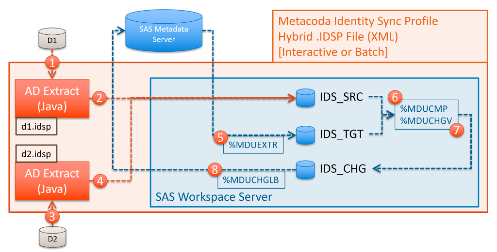

# Identity Sync Profiles & Process

Metacoda Identity Sync Profiles (IDSPs) are XML files, with a file extension of .idsp, that contain
configuration information as required for the
[Metacoda Identity Sync Plug-in](https://www.metacoda.com/en/products/security-plug-ins/identity-sync/)
to synchronise target SAS® metadata identities (users and groups) with source identities, such as
users and groups from Microsoft Active Directory.
The Metacoda Identity Sync Plug-in can be used interactively, within the SAS Management Console, to
manually preview any changes before applying them to SAS metadata. Alternatively, Identity Sync
Profiles can also be processed by the Metacoda Plug-ins Batch Interface so that automatic identity
synchronisations can be regularly scheduled.  

IDSPs are usually created by using the Metacoda Identity Sync Profile Wizard within SAS Management
Console. This wizard only provides access to the most commonly used configurable elements.
To access to some of the more advanced features you will need to edit the IDSP XML directly.
Manual edits will be preserved if you subsequently use the wizard to load, modify, and save the
IDSP file. If you manually edit the IDSP while it is still open in the Identity Sync Plug-in you
will need to re-open it to pick up those manual changes.     

This documentation and the associated samples are provided to show how some of the these features
are represented in the IDSP XML in case you need to use them.

## Identity Sync Process Overview
   
At the heart of the Metacoda Identity Sync process are the well-known and time-proven SAS %MDU
macros as documented in the
[User Import Macros](https://support.sas.com/documentation/cdl/en/bisecag/69827/HTML/default/viewer.htm#p1ar98lajfgm4jn1wa1h6e19jjre.htm)
appendix of the _SAS 9.4 Intelligence Platform: Security Administration Guide_. The Metacoda
Identity Sync Plug-in wraps a further framework around these macros including:

* A SAS Management Console hosted point and click interface to create and use configurations
  (IDSPs), and interactively preview and apply identity changes to SAS metadata;
* A batch interface for the scheduled automatic application of identity changes to SAS metadata;
* A custom Java-based process that provides a variety of methods to target identities from
  a Microsoft Active Directory source, including handling of the following:
    * Deeply nested groups  
    * Paginated queries to support extraction of large numbers of identities and groups with more
      than 1,500 member.  
    * Support for following group members into other domains in the same forest. 
* Support for combining identities from multiple identity sources, such as domains in multiple AD
  forests, through Hybrid IDSPs.  
* Support for sourcing identities from an Identity Sync Export (IDSX) file, an XML format that
  can be used for identity sync between different SAS environments, or from other identity
  providers.
* The generation of Audit Reports to document the use of the identity sync process over time;
* Code hooks for customisation of the identity sync process.  

The following sections on basic and hybrid IDSPs provide some more detail on this process. 

## Single (Basic) Identity Sync Profile

Most implementation use a single basic IDSP that targets a single provider of identities such
as a single Microsoft Active Directory (AD) domain. The diagram below illustrates this process
(which is controlled by the contents of the IDSP): 

* ***Step 0 Initialisation***: A SAS Workspace Server is spawned, and 3 temporary libraries
  (IDS_SRC, IDS_TGT,  IDS_CHG) are configured to house the
  [canonical](https://support.sas.com/documentation/cdl/en/bisecag/69827/HTML/default/p1o31lg0trorn8n1rketxxe1jbr1.htm)
  and change tables as required by the SAS %MDU macros. Empty canonical tables are created using
  the standard SAS
  [%MDUIMPC](https://support.sas.com/documentation/cdl/en/bisecag/69827/HTML/default/p03uv2agudmy9cn1kn8hoek7so6u.htm)
  macro. 
* ***Step 1 Source Extract***: A custom Java-based process connects to an AD server and extracts
  information for the targeted identities (users and groups) as specified in the IDSP.
* ***Step 2 Source Upload***: The source identities extracted in step 1 are uploaded into tables in
  the IDS_SRC library.
* ***Step 3 Target Extract***: The standard SAS
  [%MDUEXTR](https://support.sas.com/documentation/cdl/en/bisecag/69827/HTML/default/n024i4nqa5b12qn1lfek77h69ns5.htm) 
  macro is used to extract target identities from the SAS metadata server into canonical tables in
  the IDS_TGT library.
* ***Step 4 Compare***:  The standard SAS
  [%MDUCMP](https://support.sas.com/documentation/cdl/en/bisecag/69827/HTML/default/p0fmb77lv8a6k5n1ciomw5jik6ft.htm)
  macro is used to compare source identities from the IDS_SRC library with target identities from
  the IDS_TGT library.
  Any sync exceptions specified in the IDSP are also provided to the macro so that those identities
  can be ignored as required.
  Any changes that need to be applied to the target SAS identities to get them back into sync with
  the source AD identities will be generated as change tables the IDS_CHG library.
  If tag-deletion has been specified in the IDSP then Metacoda augments this process by converting
  any user/group deletions into updates to represent tag-deletes.
* ***Step 5 Validate***: The standard SAS
  [%MDUCHGV](https://support.sas.com/documentation/cdl/en/bisecag/69827/HTML/default/n13q0r5qkhhg5un198d7zpgr4pbu.htm)
  macro is used to valid any changes present in
  IDS_CHG libraries change tables. If any validation errors are detected the identity sync process
  is aborted.
* ***Step 6 Apply Changes***: If there are changes to be applied, and no validation errors, then
  the standard SAS
  [%MDUCHGLB](https://support.sas.com/documentation/cdl/en/bisecag/69827/HTML/default/n0s5720n7tlwtfn1lkqx68z0bu82.htm)
  macro is used to apply changes to SAS metadata using the change tables in the IDS_CHG library.

A basic IDSP to implement synchronisation with a single Active Directory server has the following
general structure:   

    <?xml version="1.0" encoding="UTF-8"?>
    <IdentitySyncProfile ...>
      <IdentitySource type="activeDirectoryServer"/>
      <LDAPConfig ... />
      <GroupSync ...> 
        <IncludedGroups>
          <Group name="Group1" ... />
          <Group name="Group2" ... />
          ...
        </IncludedGroups>
      </GroupSync>
      <UserSync ... />
      <Options ... />
      <SyncExceptions>
        <SyncException ... />
        ...
      </SyncExceptions>
    </IdentitySyncProfile>
    
* The `<IdentitySource>` tag indicates the source for identities, in this case AD.
* The `<LDAPConfig>` contains details of how to connect to AD: host name, port, protocol,
  credentials, whether to use encryption, base DNs and filters for search, attribute mappings etc.
* The `<GroupSync>` tag specifies the basis for identifying targeted groups, excluded groups, and
  general group related options.    
* The `<UserSync>` tag specifies the basis for identifying targeted users, excluded users, and
  general user related options.
* The `<Options>` tag has some generic options for the sync process.
* The `<SyncExceptions>` tag is used to specify any identities to be ignored.    

See <https://github.com/Metacoda/idsync-utils/blob/master/samples/idsync-ad-basic.idsp> for a
complete example. 

## Multiple (Hybrid) Identity Sync Profiles

In more complex environments there might be a need to synchronise SAS identities from multiple
independant sources. Hybrid Identity Sync Profiles, available since Metacoda Plug-ins 6.01 R1, can
be used in situations where is not possible to obtain all required SAS identities using a single
Identity Sync Profile.

If you were to try to simply use multiple IDSPs in sequence, the identities that were added by the
first IDSP would be deleted by the processing of the second IDSP. This is why we need a hybrid IDSP
that collects all of the identities from multiple sources before it attempts to synchronise them
with SAS metadata.   

A hybrid IDSP is structured as a parent, or wrapper, IDSP that references individual child, or
included, IDSPs like so:      

    <?xml version="1.0" encoding="UTF-8"?>
    <IdentitySyncProfile ...>
      <IdentitySource type="hybrid"/>
      <IncludeIdentitySyncProfile path="d1.idsp"/>
      <IncludeIdentitySyncProfile path="d2.idsp"/>
      ...
      <Options ... />
      <SyncExceptions>
        <SyncException ... />
        ...
      </SyncExceptions>
    </IdentitySyncProfile>

In the IDSP above, the `<IdentitySource>` tag identifies it as a Hybrid IDSP, and the multiple
`<IncludeIdentitySyncProfile>` tags identity the other child IDSPs to be used to source identities.
You can have as many `<IncludeIdentitySyncProfile>` tags as necessary.

The Identity Sync Profile Wizard cannot currently be used to create a Hybrid IDSP - it must be
created using an XML or text editor using the above, or one of the samples in this repository,
as a template. The individual included child IDSPs can be generated using the wizard, although
you would not normally apply the changes from a child IDSP on its own except when testing it in a
sandpit environment.
  
The Identity Sync Process differs slightly with Hybrid IDSPs. The diagram below illustrates this,
where a Hybrid IDSP includes 2 child IDSPs, *d1* and *d2*:

* ***Step 0 Initialisation***: A SAS Workspace Server is spawned, the IDS_SRC, IDS_TGT, and IDS_CHG
  temporary libraries are configured, and empty canonical tables added using the standard SAS
  %MDUIMPC macro. 
* ***Step 1 Source #1 Extract (d1)***: Source identities are fetched from the first AD server as
  specified in the first child IDSP d1.idsp.
* ***Step 2 Source #1 Upload (d1)***: The first batch of source identities from step 1 are uploaded
  and appended to the IDS_SRC tables.
* ***Step 3 Source #2 Extract (d2)***: Source identities are fetched from the second AD server as
  specified in the second child IDSP d2.idsp.
* ***Step 4 Source #2 Upload (d2)***: The second batch of source identities from step 3 are
  uploaded and appended to the IDS_SRC tables.
* ***Step 5 Target Extract***: The standard SAS %MDUEXTR macro is used to extract target identities
  from the SAS metadata server into canonical tables in the IDS_TGT library.
* ***Step 6 Compare***:  The standard SAS %MDUCMP macro is used to compare the combined set of
  source identities from the IDS_SRC library with target identities from the IDS_TGT library to
  generate change tables the IDS_CHG library.
  Any sync exceptions specified in the ***Hybrid IDSP*** are also provided to the macro so that
  those identities can be ignored as required. Any sync exceptions specified in the child IDSPs are
  ignored. 
  If tag-deletion has been specified in the ***Hybrid IDSP*** then Metacoda augments this process
  by converting any user/group deletions into updates to represent tag-deletes.
* ***Step 7 Validate***: The standard SAS %MDUCHGV macro is used to valid any changes present in
  IDS_CHG libraries change tables. If any validation errors are detected the identity sync process
  is aborted.
* ***Step 8 Apply Changes***: If there are changes to be applied, and no validation errors, then
  the standard SAS %MDUCHGLB macro is used to apply changes to SAS metadata using the change tables
  in the IDS_CHG library.

Some other noteworthy differences in Hybrid IDSP processing when compared to single IDSP processing:

* Any `<Options>` or `<SyncExceptions>` tags, and any code hooks except `<PreSourceExtractCode>`
  and `<PostSourceExtractCode>`, that are specified in child IDSPs are ignored.
* `<Options>` and `<SyncExceptions>` tags are only considered when specified in the Hybrid IDSP.
* If `<PreSourceExtractCode>` and `<PostSourceExtractCode>` code hooks are specified in the Hybrid
  IDSP then they are processed before and after all child IDSPs source identity extractions.
* Any `<LDAPConfig>`, `<IDSXFileConfig>`, `<GroupSync>`, and `<UserSync>` tags specified in the
  Hybrid IDSP are ignored.
* All code hooks in the Hybrid IDSP are processed.

See <https://github.com/Metacoda/idsync-utils/blob/master/samples/idsync-ad-hybrid.idsp>,
<https://github.com/Metacoda/idsync-utils/blob/master/samples/idsync-ad-hybrid-d1.idsp>, and
<https://github.com/Metacoda/idsync-utils/blob/master/samples/idsync-ad-hybrid-d2.idsp>
for a complete hybrid IDSP example.